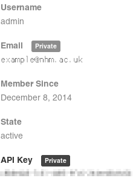

# Introduction

Welcome to the Data Portal API docs!

The Natural History Museum in London, UK shares a wealth of its research data via the [Data Portal](http://data.nhm.ac.uk) website. The API provides a RESTful interface to this information.

Please feel free to [contact us](http://data.nhm.ac.uk/contact) if you have any questions!

You can also reach us and discuss issues with other users on the Data Portal [Gitter](https://gitter.im/nhm-data-portal/Lobby).

# Basics

## Access

```python
# install the pyportal library with:
# pip install nhm-pyportal

import pyportal

# only if auth is needed (usually not)
api_key = 'your-api-key'
# otherwise
api_key = None

# create an API class instance
api = pyportal.API(api_key)
```

The base URL for the API is `http://data.nhm.ac.uk/api/3`.

Most of the Data Portal API does not currently require any kind of authentication. However, if you want to modify or add datasets via the API, you will need an API key. This can be found on your user page (it's only visible to you when you're logged in):



<aside class="notice">
Please use common sense when using the API, and cache results wherever possible. We reserve the right to suspend API access if you continuously make multiple calls per second.
</aside>

## Results

> A basic successful result looks like this:

```json
{
  "help": "A description of the action.",
  "success": true,
  "result": ["item1", "item2"]
}
```

> An unsuccessful result looks like this:

```json
{
  "help": "A description of the action.",
  "success": false,
  "error": {
    "message": "This is what you did wrong.",
    "__type": "ErrorType"
  }
}
```

Results are returned in JSON format, with two basic keys: `help` (which describes the action called) and `success` (a boolean indicating whether the request was successful or not).

If the request was successful, the items will be returned under the `result` key.

If the action was valid but the parameters were not, you will get `success: false` and an error message.

# Datastore

The Data Portal contains all kinds of resource files, including CSVs, Darwin Core Archives (DwC-A), PDFs, videos, zips and 3D data.
For some resource file types, such as CSV, the data in the file is ingested into the Datastore, making it searchable and allowing it to be presented in different views like grids and maps.


## Search

```python
# common resource IDs are included as constants
from pyportal.constants import resources

# these examples use the specimens dataset
res_id = resources.specimens
```

```shell
RES_ID='05ff2255-c38a-40c9-b657-4ccb55ab2feb'
URL='http://data.nhm.ac.uk/api/3/action/datastore_search'
```

This endpoint allows you to search the Datastore.
Both `GET` and `POST` requests are supported, but it is recommended that you use `POST` requests as this allows you to pass the parameters in JSON rather than in the query string which can get a bit messy.

`GET`/`POST` `http://data.nhm.ac.uk/api/3/action/datastore_search`

`resource_id` is the only required parameter.

### Query Parameters

> _Getting all specimen data_

```python
search = api.records(res_id)

for record in search.all():
    print(record)
```

```shell
curl -X POST \
  --header "Content-Type: application/json" \
  --data="{'resource_id': $RES_ID}" \
  $URL
```

> _Getting specimens which match the free text search "banana"_

```python
search = api.records(res_id, query='banana')

for record in search.all():
    print(record)
```

```shell
curl -X POST \
  --header "Content-Type: application/json" \
  --data="{'resource_id': $RES_ID, 'q': 'banana'}" \
  $URL
```

> _Getting just specimens from Mexico_

```python
search = api.records(res_id, country='Mexico')

for record in search.all():
    print(record)
```

```shell
curl -X POST \
  --header "Content-Type: application/json" \
  --data="{'resource_id': $RES_ID, 'filters': {'country': 'Mexico'}}" \
  $URL
```

> _Getting more specimen results from Mexico_

```python
# the pyportal .all() method already pages
# through the results without you having to
# set the offset manually, but you can skip
# the first n records by setting an offset

search = api.records(res_id,
                     offset=100,
                     country='Mexico')

for record in search.all():
    print(record)
```

```shell
curl -X POST \
  --header "Content-Type: application/json" \
  --data="{'resource_id': $RES_ID, 'filters': {'country': 'Mexico'}, 'offset': 100}" \
  $URL
```

> _Getting specimens which match the free text search "banana", have the Botany collection code and then sorting them on genus (descending order)_

```python
search = api.records(res_id,
                     sort=['genus desc'],
                     query='banana',
                     collectionCode='bot')

for record in search.all():
    print(record)
```

```shell
curl -X POST \
  --header "Content-Type: application/json" \
  --data="{'resource_id': $RES_ID, 'q': 'banana', 'filters': {'collectionCode': 'bot'}, 'sort': ['genus desc']}" \
  $URL
```


#### `resource_id` (required)
The ID of the resource to search.

_Example:_ `05ff2255-c38a-40c9-b657-4ccb55ab2feb`

#### `q`
A full text query value to be matched against any field in the records.

_Default:_ No query is applied

_Example:_ `banana`

#### `filters`
A JSON object containing fields values to filter the records by.

_Default:_ No filters are applied

_Example:_ `{"country": "Mexico"}`

#### `offset`
Offset by this number of rows before returning the resulting records.

_Default:_ `0`

_Example:_ `10`

#### `limit`
The maximum number of records to return in the result.

_Default:_ `100`

_Example:_ `50`

#### `fields`
A list of the record fields to return in the result.
If not included in the request then all fields are returned, otherwise the list passed is used to filter the field returned.

_Default:_ All fields are returned

_Example:_ a list: `["country", "scientificName"]` or a comma-separated string: `country,scientificName`

#### `sort`
A list of fields and sort directions.

_Default:_ No sort is applied

_Example:_ a list: `["scientificName", "country desc"]` or a comma-separated string: `"scientificName,country desc"`

### Results

> An example records array with a single record

```json
[
  {
    family: "Molossidae",
    institutionCode: "NHMUK",
    month: "1",
    phylum: "Chordata",
    subDepartment: "Mammalia",
    year: "1886",
    continent: "North America",
    occurrenceID: "2d149656-f929-4bf0-a744-f45d544edac7",
    higherClassification: "Animalia; Chordata; Vertebrata; Mammalia; Chiroptera; Molossidae",
    locality: "Cozumel Island, Yucatan",
    otherCatalogNumbers: "NHMUK:ecatalogue:3594234",
    catalogNumber: "88.1.1.1",
    _version_: "1615759337304621059",
    specificEpithet: "laticaudatus / gracilis",
    kingdom: "Animalia",
    determinationFiledAs: "Yes",
    collectionCode: "ZOO",
    higherGeography: "North America; Mexico",
    determinationNames: "Nyctinomops nyctinomus laticaudatus / gracilis",
    class: "Mammalia",
    individualCount: "1",
    genus: "Nyctinomops nyctinomus",
    created: "",
    country: "Mexico",
    basisOfRecord: "Specimen",
    modified: "",
    scientificName: "Nyctinomops nyctinomus laticaudatus / gracilis",
    registrationCode: "MA",
    _id: 3594234,
    order: "Chiroptera"
  },
]
```

> An example fields array containing a single text field `"continent"`

```json
[
  {
    "id": "continent",
    "type": "text"
  }
]
```


A JSON object is returned. In the return a `result` key will be present which in turn will have the following keys within it.

#### `records`

An array of objects containing the record data from the search.

#### `total`
The total number of records found in the search.

#### `fields`
An array of objects containing information about all the fields in this resource and their types

#### `_backend`
The backend that provided the search results - this can be ignored for general use!

#### `resource_id`
The ID of the resource that was searched - this can be ignore for general use!
